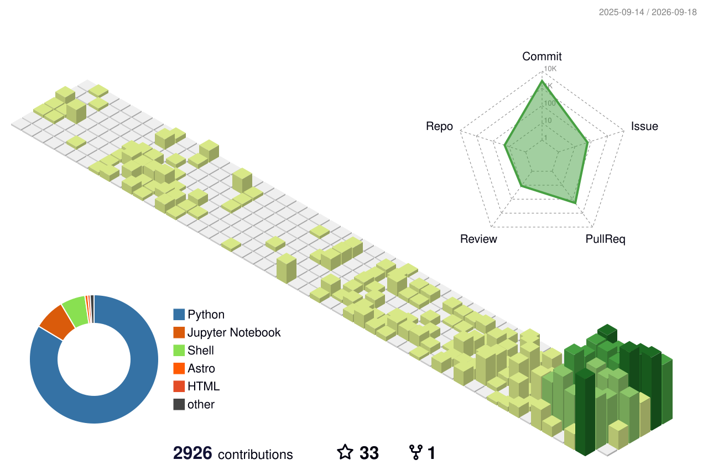

# 👋 Hi, I'm Yohei Ohto

- 🔬 Researcher / Developer at **Mizuno Group**
- 🌐 Personal Page: [yoheiohto.github.io](https://yoheiohto.github.io/)
- 🧪 Mizuno Group HP: [mizuno-group.com](https://www.mizuno-group.com/)
- 🧬 Mizuno Group GitHub: https://github.com/mizuno-group

---

## 🛠️ Skills & Tech Stack

### Languages & Frameworks

### Tools & Platforms

### AI Coding Agents

### Biomedical Data & Knowledge Graphs

---

## 🧭 About Me

- 💻 Interested in **computational science**, **data-driven modeling**, and **scientific software**
- ⚙️ Passionate about building clean, reproducible, and impactful research code
- 🌱 Always exploring new tools & frameworks to accelerate scientific discovery

---

## 📊 Activity & Statistics

### 📅 3D Contribution Calendar

<!-- 3D草をリポジトリから静的に読み込みます。絶対にリンク切れしません -->

### 🏆 Achievements & 🈷️ Languages

<!-- GitHub Actionsで生成した実績・言語インフォグラフィックスを読み込みます。絶対にリンク切れしません -->

---

## 📫 Contact

Feel free to reach out through **GitHub Issues**, **email** ([oy826c60@gmail.com](mailto:oy826c60@gmail.com)), or via my [website](https://yoheiohto.github.io/).
